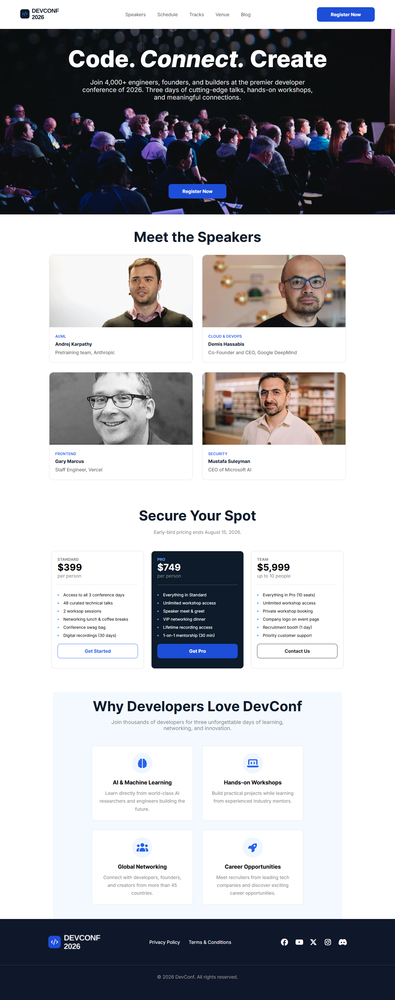

# 🎤 DevConf 2026

A modern and responsive developer conference landing page built as a frontend project. DevConf 2026 presents conference information including speakers, schedule, pricing plans, tracks, venue, and registration sections.

## 🚀 Live Demo

👉 [DevConf 2026 Live Demo](https://mdraju116.github.io/assignment-01/)

## 📸 Project Screenshot




## 🛠️ Technology Stack

* HTML5
* CSS3
* CSS Flexbox
* CSS Grid
* Responsive Design
* Google Fonts — Inter
* Font Awesome

## ✨ Key Features

* 🎤 Hero section with conference introduction
* 🧑‍💻 Speaker showcase section
* 📅 Conference schedule
* 🎟️ Multiple pricing plans
* ⭐ Highlighted popular/pro plan
* 📊 Feature comparison section
* 📍 Venue information
* 📝 Registration call-to-action
* 📱 Responsive design for different screen sizes
* 🎨 Modern and clean UI
* 🖼️ Custom project assets

## 📂 Project Structure

```text
assignment-01/
│
├── assets/
│   ├── images
│   └── logos/icons
│
├── index.html
├── style.css
└── PROMPTS.md
```

## 💻 Run Locally

### 1. Clone the repository

```bash
git clone https://github.com/mdraju116/assignment-01.git
```

### 2. Open the project

```bash
cd assignment-01
```

### 3. Run the project

Simply open `index.html` in your browser.

For a better development experience, you can use the **Live Server** extension in VS Code.

## 🔗 Relevant Links

* 🌐 Live Demo: https://mdraju116.github.io/assignment-01/
* 💻 GitHub Repository: https://github.com/mdraju116/assignment-01

## 👨‍💻 Author

**Md. Raju Ahammed**

GitHub: https://github.com/mdraju116
